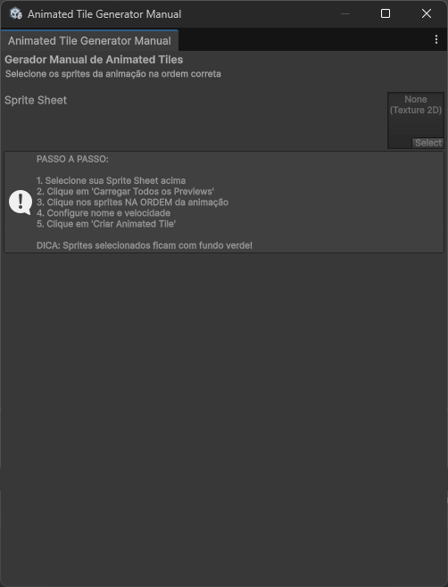

# 🎮 Animated Tile Generator for Unity

**[English](#english)** | **[Português](#português)**

---

## English

### 📖 Overview

**Animated Tile Generator** is a powerful Unity Editor tool that simplifies the creation of animated tiles for 2D games. Instead of manually creating an Animated Tile asset for each animation, this tool provides an intuitive visual interface where you can select sprites in sequence and generate the animated tile with just one click.

Perfect for:

- 2D pixel art games
- Tilemap-based projects
- Games with animated water, lava, fire, grass, etc.
- Any project using Unity's Tilemap system

### ✨ Features

- **Visual Sprite Selection**: See all your sprites in a grid and click them in animation order
- **Automatic Preview Loading**: Loads all sprite previews with progress indication
- **Smart Selection System**: Selected sprites are highlighted in green with order numbers
- **Flexible Configuration**: Adjust animation speed, output folder, and grid layout
- **Batch Creation**: Create multiple animated tiles without closing the window
- **Clean UI**: Organized interface with clear visual feedback
- **No Code Required**: Everything is done through an intuitive visual interface

### 🚀 Installation

1. Download the `AnimatedTileGeneratorManual.cs` file
2. In your Unity project, create a folder: `Assets/Editor` (if it doesn't exist)
3. Place the script inside the `Assets/Editor` folder
4. Unity will automatically compile the script

### 📋 Requirements

- Unity 2020.3 or newer (tested on Unity 6.2)
- Unity 2D Tilemap Extras package (install via Package Manager)

### 🎯 How to Use

#### Step 1: Prepare Your Sprite Sheet

1. Import your sprite sheet into Unity
2. Select it in the Project window
3. In the Inspector, configure:

   - **Texture Type**: Sprite (2D and UI)
   - **Sprite Mode**: Multiple
   - **Pixels Per Unit**: 16 (or your tile size)
   - **Filter Mode**: Point (no filter) - for pixel art
   - **Compression**: None
   - **Advanced → Read/Write Enabled**: ✓ **CHECKED** (important!)
   - Click **Apply**

4. Click **Sprite Editor**
5. Click **Slice** → **Grid By Cell Size**
6. Set your tile size (e.g., 16x16)
7. Click **Slice** then **Apply**

#### Step 2: Open the Tool

- Go to **Tools → Animated Tile Generator (Manual)** in the Unity menu

#### Step 3: Load Your Sprites

1. Drag your sprite sheet into the **Sprite Sheet** field
2. Click the blue button **"Load All Previews"**
3. Wait for the progress bar to complete
4. You should see: "✓ All 264 previews loaded!" (or your sprite count)

#### Step 4: Select Animation Frames

1. Click on sprites **IN THE ORDER** you want them to animate
2. Selected sprites will have a **green background** and show **✓#1, ✓#2, etc.**
3. To remove a sprite: click the **X button** on selected sprites at the top
4. To clear all: click **"Clear Selection"**

#### Step 5: Configure and Create

1. **Tile Name**: Give your animated tile a name
2. **Speed**: Adjust animation speed (1 = normal)
3. **Output Folder**: Choose where to save (default: Assets/Tiles)
4. Click **"Create Animated Tile"** button

#### Step 6: Use in Your Scene

1. Open your Tile Palette (**Window → 2D → Tile Palette**)
2. Drag the created Animated Tile into your palette
3. Paint it on your Tilemap - it will animate automatically!

### 🎨 Tips & Tricks

- **Grid Columns**: Adjust to see more or fewer sprites per row
- **Button Size**: Make sprite buttons larger or smaller as needed
- **Multiple Animations**: Create multiple animated tiles without closing the window
- **Reorder**: If you made a mistake, click "Clear Selection" and start over
- **Read/Write**: If previews don't load, make sure your sprite sheet has "Read/Write Enabled" checked

### ⚠️ Troubleshooting

**Previews are gray/not loading:**

- Select your sprite sheet in Project
- In Inspector, find **Advanced → Read/Write Enabled**
- Check this option ✓
- Click **Apply**
- Reload the tool and click "Load All Previews" again

**GUI Errors in console:**

- Close the tool window
- Reopen it from **Tools → Animated Tile Generator (Manual)**

**Sprites not animating in scene:**

- Make sure you're using the Animated Tile (not regular tiles)
- Check that you selected multiple sprites (minimum 2)
- Press Play to see the animation

### 📦 What Gets Created

The tool creates `.asset` files in your specified output folder:

- Each file is an `AnimatedTile` asset
- Contains references to your selected sprites in order
- Can be used directly in Unity's Tile Palette
- Lightweight and performant - no GameObjects created

### 🤝 Contributing

Contributions are welcome! Feel free to:

- Report bugs
- Suggest new features
- Submit pull requests
- Share your creations

### 📄 License

This project is open source and available under the MIT License.

### 👨‍💻 Author

Created by **Gustavo** - [github.com/gustavoweb](https://github.com/gustavoweb)

### 🌟 Support

If this tool helped you, consider:

- ⭐ Starring the repository
- 🐛 Reporting issues
- 📢 Sharing with other Unity developers

---

## Português

### 📖 Visão Geral

**Animated Tile Generator** é uma ferramenta poderosa para o Editor Unity que simplifica a criação de tiles animados para jogos 2D. Ao invés de criar manualmente um asset Animated Tile para cada animação, esta ferramenta fornece uma interface visual intuitiva onde você pode selecionar sprites em sequência e gerar o tile animado com apenas um clique.

Perfeito para:

- Jogos 2D pixel art
- Projetos baseados em Tilemap
- Jogos com água, lava, fogo, grama animados, etc.
- Qualquer projeto usando o sistema Tilemap da Unity

### ✨ Recursos

- **Seleção Visual de Sprites**: Veja todos os seus sprites em uma grade e clique neles na ordem da animação
- **Carregamento Automático de Previews**: Carrega todos os previews dos sprites com indicação de progresso
- **Sistema de Seleção Inteligente**: Sprites selecionados são destacados em verde com números de ordem
- **Configuração Flexível**: Ajuste velocidade de animação, pasta de saída e layout da grade
- **Criação em Lote**: Crie múltiplos tiles animados sem fechar a janela
- **Interface Limpa**: Interface organizada com feedback visual claro
- **Sem Código Necessário**: Tudo é feito através de uma interface visual intuitiva

### 🚀 Instalação

1. Baixe o arquivo `AnimatedTileGeneratorManual.cs`
2. No seu projeto Unity, crie uma pasta: `Assets/Editor` (se não existir)
3. Coloque o script dentro da pasta `Assets/Editor`
4. A Unity vai compilar o script automaticamente

### 📋 Requisitos

- Unity 2020.3 ou mais recente (testado na Unity 6.2)
- Pacote Unity 2D Tilemap Extras (instalar via Package Manager)

### 🎯 Como Usar

#### Passo 1: Preparar Sua Sprite Sheet

1. Importe sua sprite sheet para a Unity
2. Selecione ela na janela Project
3. No Inspector, configure:

   - **Texture Type**: Sprite (2D and UI)
   - **Sprite Mode**: Multiple
   - **Pixels Per Unit**: 16 (ou o tamanho do seu tile)
   - **Filter Mode**: Point (no filter) - para pixel art
   - **Compression**: None
   - **Advanced → Read/Write Enabled**: ✓ **MARCADO** (importante!)
   - Clique em **Apply**

4. Clique em **Sprite Editor**
5. Clique em **Slice** → **Grid By Cell Size**
6. Defina o tamanho do seu tile (ex: 16x16)
7. Clique em **Slice** e depois **Apply**

#### Passo 2: Abrir a Ferramenta

- Vá em **Tools → Animated Tile Generator (Manual)** no menu da Unity

#### Passo 3: Carregar Seus Sprites

1. Arraste sua sprite sheet para o campo **Sprite Sheet**
2. Clique no botão azul **"Carregar Todos os Previews"**
3. Aguarde a barra de progresso completar
4. Você deve ver: "✓ Todos os 264 previews carregados!" (ou sua contagem de sprites)

#### Passo 4: Selecionar Frames da Animação

1. Clique nos sprites **NA ORDEM** que você quer que eles animem
2. Sprites selecionados terão **fundo verde** e mostrarão **✓#1, ✓#2, etc.**
3. Para remover um sprite: clique no **botão X** nos sprites selecionados no topo
4. Para limpar tudo: clique em **"Limpar Seleção"**

#### Passo 5: Configurar e Criar

1. **Nome do Tile**: Dê um nome para seu tile animado
2. **Velocidade**: Ajuste a velocidade da animação (1 = normal)
3. **Pasta de Saída**: Escolha onde salvar (padrão: Assets/Tiles)
4. Clique no botão **"Criar Animated Tile"**

#### Passo 6: Usar na Sua Cena

1. Abra sua Tile Palette (**Window → 2D → Tile Palette**)
2. Arraste o Animated Tile criado para sua paleta
3. Pinte no seu Tilemap - vai animar automaticamente!

### 🎨 Dicas e Truques

- **Colunas da Grade**: Ajuste para ver mais ou menos sprites por linha
- **Tamanho dos Botões**: Deixe os botões de sprite maiores ou menores conforme necessário
- **Múltiplas Animações**: Crie múltiplos tiles animados sem fechar a janela
- **Reordenar**: Se errou, clique em "Limpar Seleção" e comece de novo
- **Read/Write**: Se os previews não carregarem, certifique-se de que sua sprite sheet tem "Read/Write Enabled" marcado

### ⚠️ Solução de Problemas

**Previews estão cinzas/não carregam:**

- Selecione sua sprite sheet no Project
- No Inspector, encontre **Advanced → Read/Write Enabled**
- Marque esta opção ✓
- Clique em **Apply**
- Recarregue a ferramenta e clique em "Carregar Todos os Previews" novamente

**Erros de GUI no console:**

- Feche a janela da ferramenta
- Reabra pelo menu **Tools → Animated Tile Generator (Manual)**

**Sprites não animam na cena:**

- Certifique-se de estar usando o Animated Tile (não tiles normais)
- Verifique se selecionou múltiplos sprites (mínimo 2)
- Pressione Play para ver a animação

### 📦 O Que É Criado

A ferramenta cria arquivos `.asset` na pasta de saída especificada:

- Cada arquivo é um asset `AnimatedTile`
- Contém referências aos seus sprites selecionados em ordem
- Pode ser usado diretamente na Tile Palette da Unity
- Leve e performático - nenhum GameObject é criado

### 🤝 Contribuindo

Contribuições são bem-vindas! Sinta-se livre para:

- Reportar bugs
- Sugerir novos recursos
- Enviar pull requests
- Compartilhar suas criações

### 📄 Licença

Este projeto é open source e está disponível sob a Licença MIT.

### 👨‍💻 Autor

Criado por **Gustavo** - [github.com/gustavoweb](https://github.com/gustavoweb)

### 🌟 Apoio

Se esta ferramenta te ajudou, considere:

- ⭐ Dar uma estrela no repositório
- 🐛 Reportar problemas
- 📢 Compartilhar com outros desenvolvedores Unity

---

## 📸 Screenshots

### Tool Interface

_The main interface with sprite grid and selection system_

### Windows Interface

_Window interface - Simple Tool_

### Sprite Selection Process

_Selecting sprites in animation order - green highlighting shows selected frames_

## 🎬 Video Tutorial

Watch the complete tutorial on YouTube:

_Click the image above to watch the full tutorial_

---

**Made with ❤️ for the Unity community**
